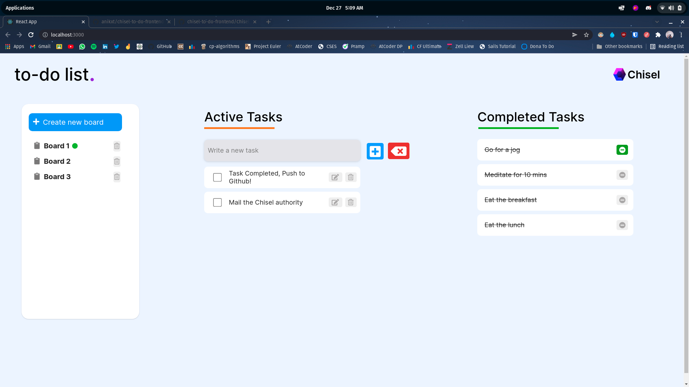

# chisel-to-do-backend

a [Sails v1](https://sailsjs.com) application

### Links

- [Sails framework documentation](https://sailsjs.com/get-started)
- [Version notes / upgrading](https://sailsjs.com/documentation/upgrading)
- [Deployment tips](https://sailsjs.com/documentation/concepts/deployment)
- [Community support options](https://sailsjs.com/support)
- [Professional / enterprise options](https://sailsjs.com/enterprise)

### Version info

This app was originally generated on Thu Dec 23 2021 19:55:31 GMT+0530 (India Standard Time) using Sails v1.5.0.

 

# How to view my to-do assignment!

1. Install all dependencies using `npm install`
2. Clone the backend file repository to local, Go to Config/Datastores.js, and edit the Adapater with your local Postgres Database server and It would just work fine.
3. Start the backend server using `sails lift`
4. Start React using npm start and you'd be able to see my task.

 

## Frontend Repository -

https://github.com/anikxt/chisel-to-do-frontend

## Backend Repository -

https://github.com/anikxt/chisel-to-do-backend

 

# Proof of Work:

